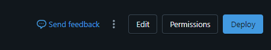
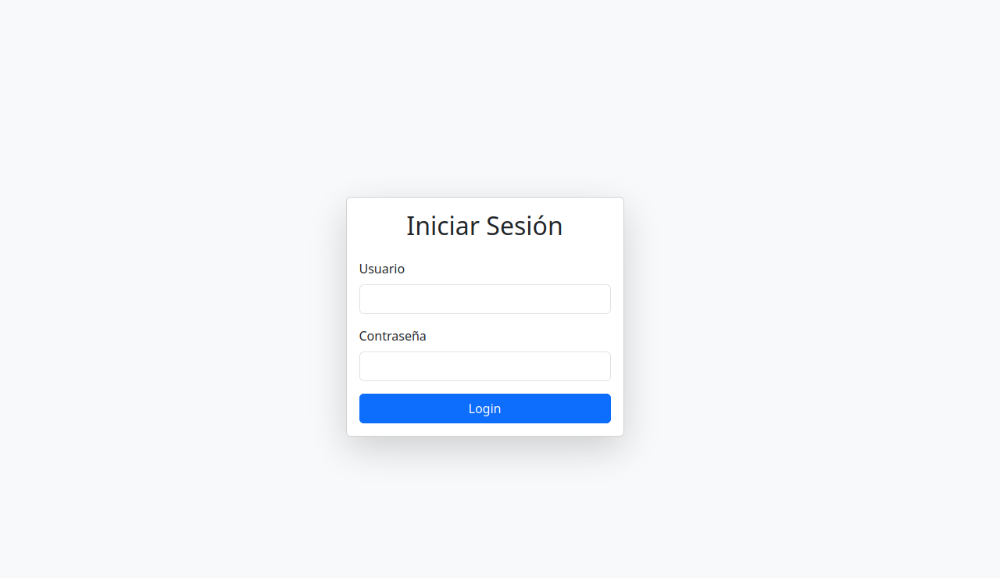
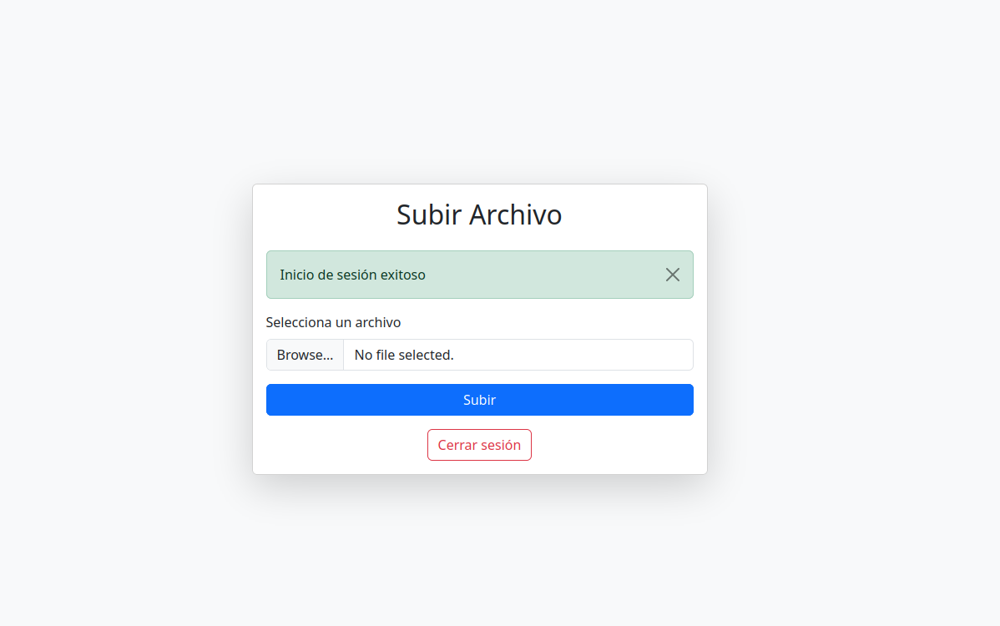

# Databricks App Templates

`databricks-app-templates` es una serie de aplicaciones desarrolladas en Flask como templates para hacer uso del entorno Databricks. Estas aplicaciones utilizan el SDK de Databricks en Python para manejar dashboards, notebooks, jobs, clusters, volúmenes, entre otros.

## Upload - Descripción

`Upload` es una plantilla sencilla de Flask que solicita login (por defecto: `admin / admin`). Posteriormente, se puede configurar para utilizar Azure Entra ID. Esta aplicación permite subir un archivo a un volumen mediante login con un host de Databricks y un token de desarrollo. *(Algunas funcionalidades aún pueden estar en desarrollo.)*

### Video Explicativo

Este video explica cómo crear una aplicación Flask personalizada y luego montar el contenido del repositorio para ejecutar. Es un proceso muy sencillo y esperamos que lo disfruten.

## Demo

## Uso

Una vez desplegada la aplicación en Databricks, puedes acceder a la URL generada, por ejemplo:

https://upload-00000000000000.00.azure.databricksapps.com

## Instalación y Configuración

1. Clonar el repositorio.
2. Copia el contenido en tu carpeta upload.
3. Ejecuta el deploy de la app en Databricks y espera a que el proceso finalice.
4. Busca la URL generada y accede, por ejemplo https://upload-00000000000000.00.azure.databricksapps.com

### Pantalla de Inicio

### Web App en Ejecución

---

alepalroj© 2025 - Databricks App Templates

